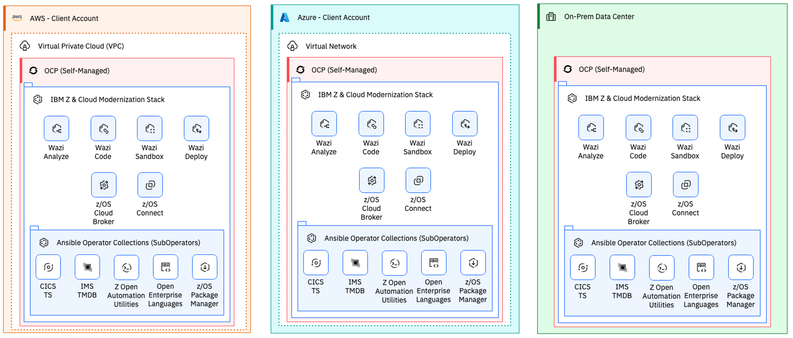

# IBM Z and Cloud Modernization Stack - Deployment Automation
Automated deployment of [IBM Z and Cloud Modernization Stack](https://www.ibm.com/products/z-and-cloud-modernization-stack) in [AWS](./aws/README.md), [Azure](./azure/README.md), and [on-prem OpenShift Container Platform](https://www.ibm.com/products/z-and-cloud-modernization-stack) environments.

See the `aws`, `azure`, or `ocp` directories for more details.
