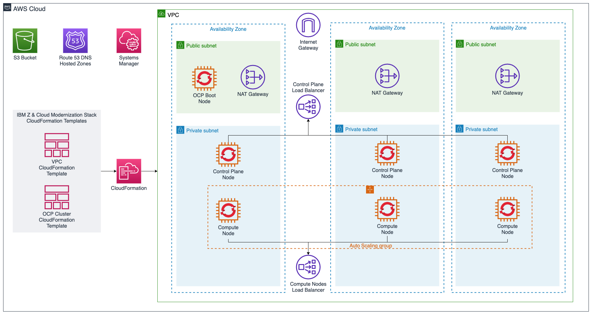

# IBM Z & Cloud Modernization Stack Deployment Tools
This repository contains scripts, documentation, and other relevant content needed to support deploying IBM Z & Cloud Modernization Stack on AWS. 

### Useful Links

- [AWS Marketplace](https://aws.amazon.com/marketplace)
    - [Private/Public Listing](https://aws.amazon.com/marketplace/pp/prodview-zxmxxmn4mge5o) - for purchasing IBM Z & Cloud Modernization Stack
    - [Bring Your Own License (BYOL) Listing](https://aws.amazon.com/marketplace/pp/prodview-rnwasmvqmymd6) - for deploying IBM Z & Cloud Modernization Stack 
- [Getting Started Guide](#)
- [Deployment Guide](https://ibm-zmodstack-public.s3.amazonaws.com/IBM_Z_And_Cloud_Modernization_Stack_Deployment_Guide.pdf)