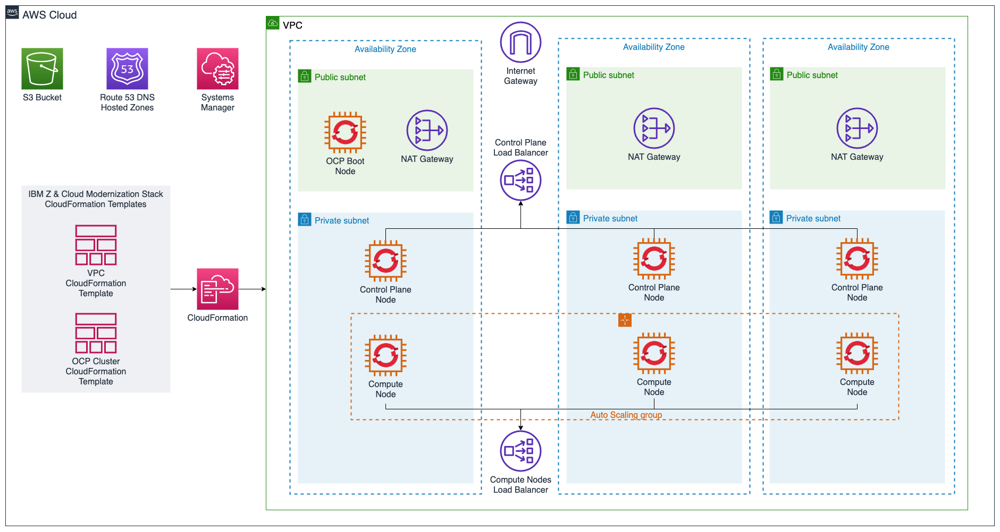

# IBM Z and Cloud Modernization Stack - CloudFormation Templates
This directory contains [AWS CloudFormation](https://aws.amazon.com/cloudformation/) templates that can be used to automate the deployment of [IBM Z and Cloud Modernization Stack](https://www.ibm.com/products/z-and-cloud-modernization-stack) in on AWS infrastructure and services.

## Architecture

## Creating an environment in AWS
Deploying an IBM Z and Cloud Modernization Stack environment in AWS is performed using CloudFormation (CFN) templates and Terraform (TF) scripts.

### Using the AWS CloudFormations UI
1. Navigate to the [CloudFormation Service](https://console.aws.amazon.com/cloudformation)
1. Press **Create Stack** and select **With new resources**
1. Provide one of the following values:
   1. **Amazon S3 URL**:  `https://ibm-zmodstack-public.s3.amazonaws.com/cloudformation/main.yml`
   1. **Upload a template file**: Use `main.yml`
1. Press **Next**, supply a **Stack name** and fill out the rest of the form. 