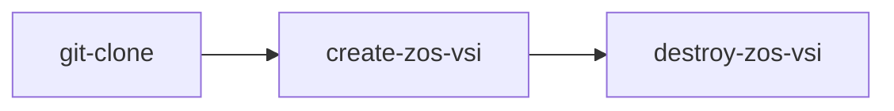

# IBM Z & Cloud Modernization Stack - Tekton Pipelines & Tasks
This directory contains [tekton](https://tekton.dev/) resources for deploying IBM Z & Cloud Modernization Stack using [Openshift Pipelines](https://docs.openshift.com/pipelines/1.12/about/op-release-notes.html).

## Prerequisites
1. Install OpenShift Pipelines via OCP OperatorHub


## Quick Start
These steps will configure a Tekton Pipeline in a newly created OCP project.

1. Login to the OCP cluster locally via the `oc` CLI
1. Create a project and apply given tekton task and pipeline
    ```bash
    oc new-project ibm-zmodstack-deploy
    oc apply -f tasks 
    oc apply -f pipelines
    ```
1. Navigate to the OCP Console, select **Pipelines** from the left-hand menu
1. Select the desired pipeline, review details, then select **Actions -> Start**
1. Fill out parameters and select a `VolumeClaimTemplate` for the workspace

## Pipelines
Details about the pipelines supplied in this repository are available below.

### [`pipelines/demo`](./pipelines/demo.yml)


**Parameters**:
- `ibmcloud_apikey` - An API key to an IBM Cloud Account where the [IBM Wazi as a Service](https://www.ibm.com/cloud/wazi-as-a-service) instance will be created.
